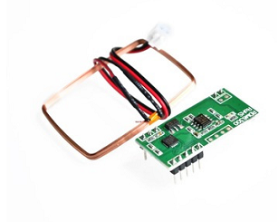

# Wokwi RDM6300 Custom Chip

This is a rdm6300 custom chip for [Wokwi](https://wokwi.com/projects/413756374638336001). It implements a RDM6300.



## Pin names

| Name | Description              |
| ---- | ------------------------ |
| RX   | The RX pin               |
| TX   | The TX pin               |
| GND  | Ground                   |
| VCC  | Supply voltage           |

## Usage

To use this chip in your project, include it as a dependency in your `diagram.json` file:

```json
  "dependencies": {
    "chip-rdm6300": "github:djedu28/wokwi-rdm6300-custom-chip@0.28.2"
  }
```

Then, add the chip to your circuit by adding a `chip-rdm6300` item to the `parts` section of diagram.json:

```json
  "parts": {
    ...,
    { "type": "chip-rdm6300", "id": "chip1" }
  },
```

For a complete example, see [the RDM6300 chip test project](https://wokwi.com/projects/406609878692164609).

more project [makers djedu28](https://wokwi.com/makers/djedu28)
